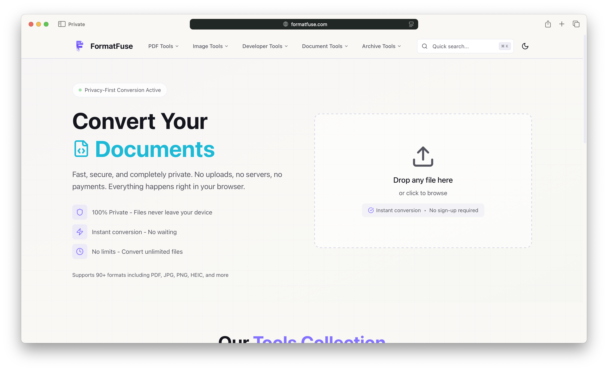

# FormatFuse

A privacy-first, browser-based file conversion toolkit. All processing happens locally using WebAssembly - your files never leave your device.

<a href='https://formatfuse.com/'>
  <picture>
    <source srcset=".github/assets/formatfuse-dark.png" media="(prefers-color-scheme: dark)" />
    <source srcset=".github/assets/formatfuse-light.png" media="(prefers-color-scheme: light)" />
    
  </picture>
</a>

## Features

### Image Tools
- **Universal Converter** - Convert between PNG, JPG, WebP, GIF, BMP, ICO, TIFF, AVIF, HEIC
- **Compressor** - Reduce file sizes while maintaining quality
- **Resizer** - Batch resize images to exact dimensions

### PDF Tools
- Merge, split, rotate, and compress PDFs
- Convert images to PDF and PDF to images
- Markdown to PDF with live preview
- PDF text extraction to Markdown
- Password protection and removal

### Video Tools
- Convert between MP4, WebM, MOV, MKV, AVI, and more
- Compress videos while preserving quality
- Trim, resize, and rotate videos
- Extract thumbnails at custom timestamps
- Extract audio to MP3, AAC, WAV, OGG, FLAC

### Archive Tools
- Create ZIP, TAR, and TAR.GZ archives
- Extract ZIP, 7Z, RAR, TAR, GZ, BZ2, XZ, and more

### Developer Tools
- JSON Formatter with validation
- JSON ↔ YAML Converter
- Base64 Encode/Decode
- QR Code Generator with custom styling
- Hash Generator (MD5, SHA-1, SHA-256, SHA-512)
- UUID Generator (v1, v3, v4, v5)
- Password Generator
- JWT Decoder
- Color Converter (HEX, RGB, HSL, HSV, CMYK, LAB, and more)
- Text Diff Checker
- Case Converter
- Word Counter

## Tech Stack

- **[Astro](https://astro.build)** - Static site generation
- **[React](https://react.dev)** - Interactive UI components
- **[Tailwind CSS v4](https://tailwindcss.com)** - Styling
- **[Radix UI](https://radix-ui.com)** - Accessible component primitives
- **[Comlink](https://github.com/GoogleChromeLabs/comlink)** - Web Worker communication

### WASM Libraries

All heavy processing is done in Web Workers using WebAssembly:

- **[@refilelabs/image](https://github.com/nicksrandall/refilelabs-image)** - Image format conversion
- **[@jsquash/*](https://github.com/jamsinclair/jSquash)** - Image codecs (PNG, JPEG, WebP, AVIF)
- **[libheif-js](https://github.com/nicksrandall/libheif-js)** - HEIC/HEIF support
- **[pdf-lib](https://pdf-lib.js.org)** - PDF manipulation
- **[pdfjs-dist](https://mozilla.github.io/pdf.js/)** - PDF rendering
- **[7z-wasm](https://github.com/nicksrandall/7z-wasm)** - 7-Zip compression
- **[libarchive-wasm](https://nicksrandall.github.io/libarchive-wasm)** - Archive extraction
- **[mediabunny](https://github.com/nicksrandall/mediabunny)** - Video processing

## Getting Started

### Prerequisites

- Node.js 18+
- pnpm 10+

### Installation

```bash
# Clone the repository
git clone https://github.com/RayLabsHQ/formatfuse.git
cd formatfuse

# Install dependencies
pnpm install

# Start development server
pnpm dev
```

The app will be available at `http://localhost:4321`.

### Scripts

| Command | Description |
|---------|-------------|
| `pnpm dev` | Start development server |
| `pnpm build` | Build for production |
| `pnpm preview` | Preview production build |
| `pnpm check` | TypeScript type checking |
| `pnpm test` | Run tests |
| `pnpm test:watch` | Run tests in watch mode |
| `pnpm test:coverage` | Run tests with coverage |
| `pnpm format` | Format code with Prettier |
| `pnpm format:check` | Check code formatting |

## Project Structure

```
src/
├── components/
│   ├── converters/     # Tool-specific components
│   ├── ui/             # Reusable UI components (shadcn-style)
│   └── core/           # Low-level components
├── pages/
│   ├── tools/          # Individual tool pages
│   ├── convert/        # Dynamic conversion routes
│   ├── extract/        # Archive extraction routes
│   └── video-tools/    # Video processing routes
├── workers/            # Web Workers for heavy computation
├── hooks/              # React hooks
├── lib/                # Utilities and Comlink wrappers
├── data/               # Tool definitions
└── layouts/            # Astro layouts
```

## Architecture

FormatFuse uses a hybrid Astro + React architecture:

1. **Astro** handles static page generation and routing
2. **React** powers interactive tool components with `client:load` hydration
3. **Web Workers + Comlink** offload heavy WASM computation off the main thread
4. **WASM libraries** provide native-speed processing entirely in the browser

### Worker Pattern

Heavy processing uses Web Workers with Comlink for type-safe communication:

```typescript
// Worker (src/workers/my.worker.ts)
class MyWorker {
  async process(data: Uint8Array): Promise<Uint8Array> { ... }
}
Comlink.expose(MyWorker);

// Hook (src/hooks/useMyTool.ts)
const worker = new Worker(
  new URL("../workers/my.worker.ts", import.meta.url),
  { type: "module" }
);
const api = Comlink.wrap<MyWorker>(worker);
const result = await api.process(data);
```

## Contributing

Contributions are welcome! Please feel free to submit a Pull Request.

1. Fork the repository
2. Create your feature branch (`git checkout -b feature/amazing-feature`)
3. Commit your changes (`git commit -m 'Add some amazing feature'`)
4. Push to the branch (`git push origin feature/amazing-feature`)
5. Open a Pull Request

## License

This project is licensed under the GNU Affero General Public License v3.0 (AGPL-3.0) - see the [LICENSE](LICENSE) file for details.

## Acknowledgments

- [Astro](https://astro.build) for the excellent static site framework
- [shadcn/ui](https://ui.shadcn.com) for UI component patterns
- All the WASM library authors for making browser-based file processing possible
